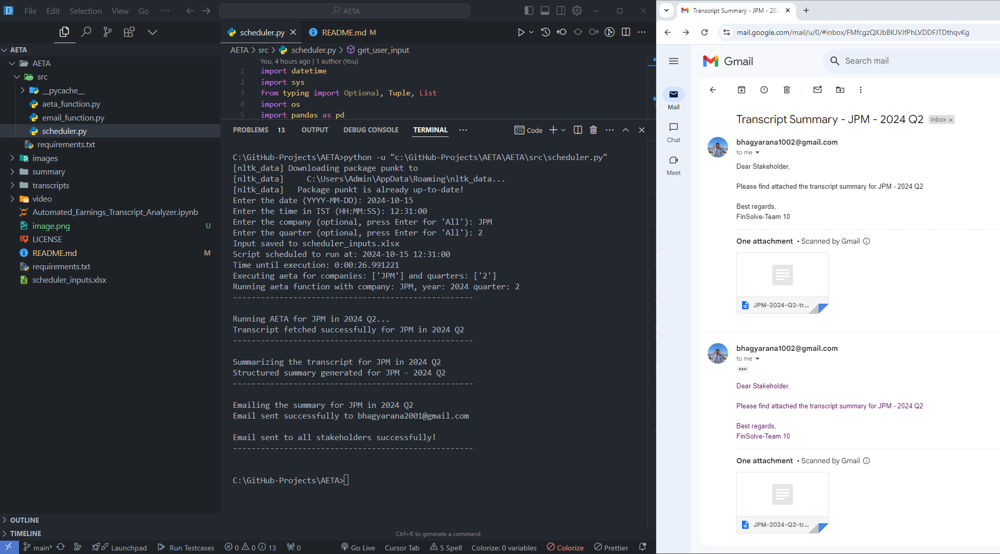

# AETA - Automated Earnings Transcript Analyzer

AETA is a Python-based tool that automates the process of analyzing earnings call transcripts for wealth management companies. It captures relevant commentary, identifies strategic priorities, and provides a peer perspective on quarterly financial performance.



Check Google Collab for Real Time Code - https://colab.research.google.com/drive/1GVml206ESH20D323dz5XdY2B1n54yyzj?usp=sharing

## Features

- Scrapes financial transcripts from company websites
- Analyzes transcripts for wealth management-related metrics and commentary
- Generates summaries with key insights
- Creates PowerPoint presentations for individual companies and peer comparisons
- Automatically emails stakeholders with results

## Process Flow

1. Scheduler triggers Python job
2. Python script scrapes financial transcripts
3. Analysis and summary generation
4. PowerPoint creation
5. Email distribution to stakeholders

## Sub-Processes

1. Downloading transcripts
2. Collecting metrics
3. Analysis
4. Generating summary in PowerPoint
5. Publishing summary to stakeholders

## Benefits

- Streamlined process
- Reduced processing time
- Increased efficiency
- Minimized errors
- Automated execution via Windows Scheduler

## Key Functionalities

- Downloads transcripts when earnings are released
- Extracts wealth management-related information using keywords
- Includes summarized Q&A sections
- Provides peer comparison of quarterly financial performance

## Installation

1. Clone the repository:

   ```
   git clone https://github.com/your-username/aeta.git
   cd aeta
   ```

2. Create a virtual environment (optional but recommended):

   ```
   python -m venv venv
   source venv/bin/activate  # On Windows, use `venv\Scripts\activate`
   ```

3. Install dependencies:

   ```
   pip install -r requirements.txt
   ```

4. Configure the `config.py` file with your settings (companies to track, email recipients, etc.)

5. Set up Windows Scheduler to run `main.py` at your desired frequency

## Usage

Run the main script:

```
python scheduler.py
```

This will execute the entire process: downloading transcripts, analyzing them, generating PowerPoint presentations, and emailing stakeholders.

## Contributing

Contributions are welcome! Please feel free to submit a Pull Request.

## License

This project is licensed under the MIT License - see the LICENSE file for details.
